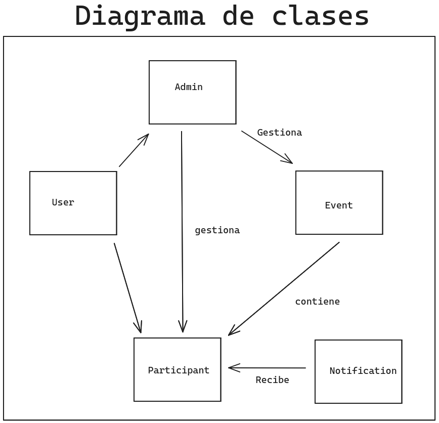
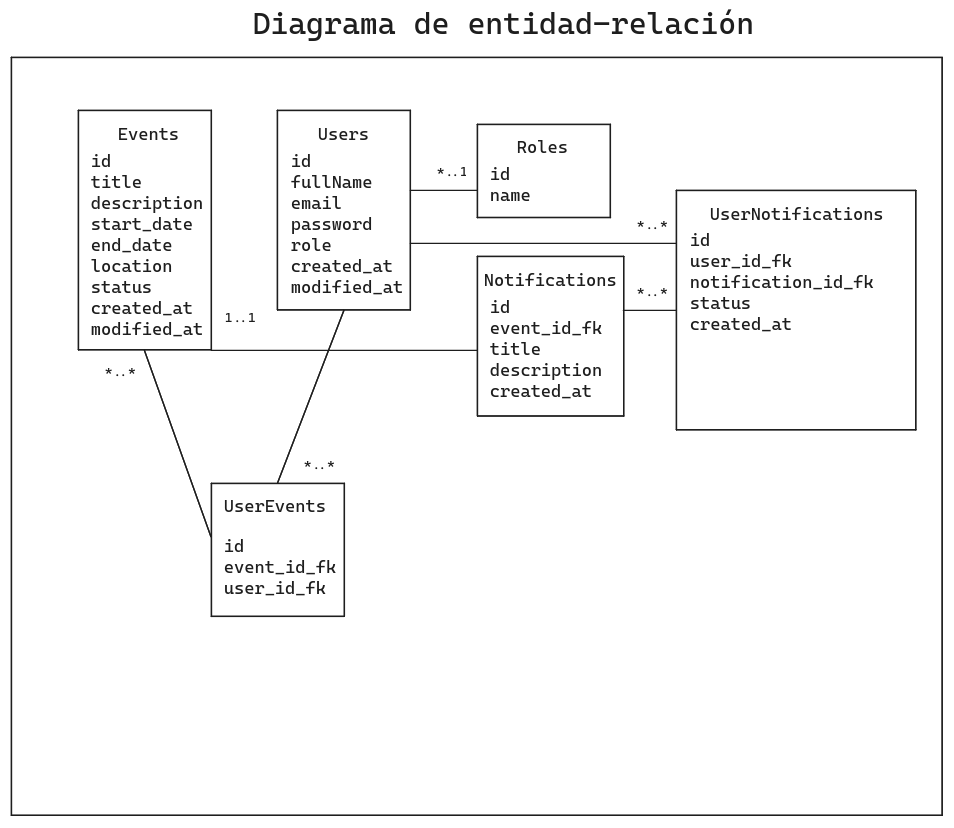
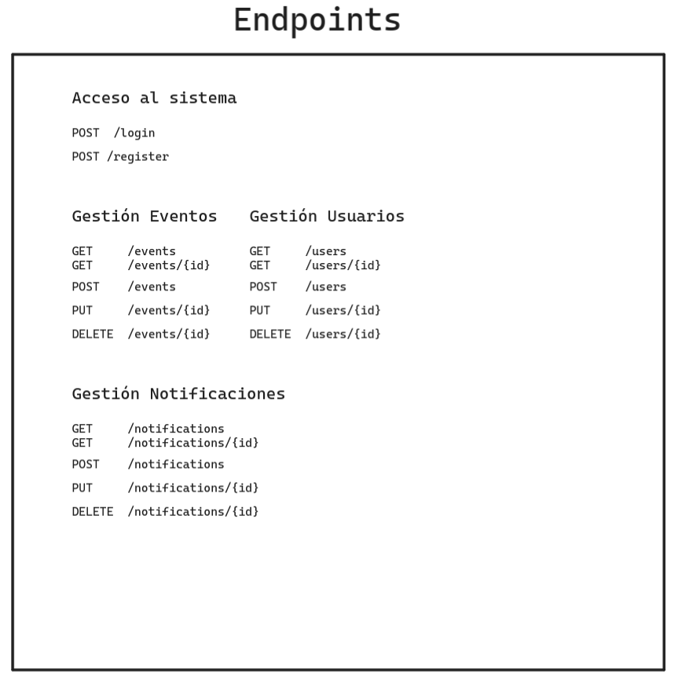

# Event Hive: Sistema de Actos Academicos

## Descripción
Event Hive es un sistema de gestión de actos académicos, el cual permite a los usuarios crear, modificar y eliminar actos académicos, así como también visualizar los actos académicos de otros usuarios, además de poder inscribirse a los mismos.

## Objetivos

### Objetivo principal:

Diseñar e implementar una aplicación web funcional que incorpore autenticación segura, gestión de datos y una base de datos estructurada, adaptada a un contexto específico seleccionado por cada alumno.

### Objetivos específicos:

1. Implementar autenticación segura:
- Desarrollar un backend de registro de usuarios.
- Configurar un sistema de inicio de sesión utilizando JWT (JSON Web Tokens).
- Asegurar la protección de rutas para restringir el acceso a usuarios no autenticados.

1. Diseñar y desarrollar una página principal de gestión:
- Crear un formulario funcional para añadir nuevos elementos según el contexto definido.
- Implementar un listado que muestre los elementos existentes de manera clara y organizada.
- Incorporar funciones de filtrado y búsqueda para facilitar la gestión de los elementos.

1. Configurar y gestionar la base de datos en PostgreSQL:
- Diseñar una tabla para almacenar los datos de los usuarios.
- Crear una tabla específica para los elementos del contexto definido.
- Establecer relaciones entre las tablas de usuarios y de contexto mediante claves foráneas para garantizar la integridad y consistencia de los datos.

## Tecnologia utilizada

Frontend:
- HTML
- CSS
- JavaScript
- Bootstrap

Backend:
- Node.js 
- Express
- PostgreSQL
- Sequelize (ORM)
- JWT 
- argon2 (para encriptar contraseñas)
- nodemon (para reiniciar el servidor automáticamente)
- cors (para permitir solicitudes de otros dominios)
- cookie-parser (para manejar cookies)
- dotenv (para cargar variables de entorno desde un archivo .env)
- morgan (para registrar solicitudes HTTP)
- sequelize (para interactuar con la base de datos)

## Instalación

1. Clonar el repositorio:
```bash
git clone https://github.com/JLRG806/Sistema-de-Actos-Academicos.git
```

2. Instalar las dependencias del servidor:
```bash
cd Sistema-de-Actos-Academicos
npm install
```

3. Crear un archivo `.env` en la carpeta raíz del servidor, puedes usar de ejemplo el archivo `.env.example`.

4. Para ejecutar el servidor:

> **NOTA:** Para ejecutar el servidor es necesario tener instalado `nodemon` globalmente. Si no lo tienes instalado, puedes instalarlo con el siguiente comando:
> ```bash
> npm install -g nodemon
> ```

Luego, puedes ejecutar el servidor con el siguiente comando:
```bash
npm run dev
```

5. Acceder en el navegador a `http://localhost:3000` para interactuar con la aplicación.

## Arquitectura de la aplicación

La aplicación sigue una arquitectura de tres capas, separando la lógica de presentación, la lógica de negocio y la lógica de acceso a datos.

- **Capa de presentación (frontend):** Se encarga de la interfaz gráfica de la aplicación, permitiendo a los usuarios interactuar con la misma de forma intuitiva y amigable, se encuentra en la carpeta `public/front-end`.

- **Capa de negocio (backend):** Contiene la lógica de negocio de la aplicación, gestionando las solicitudes del cliente, procesando los datos y enviando las respuestas correspondientes, a continuacion se explica la estructura de la carpeta `src`:
  - **Rutas:** Contiene las rutas de la API REST, que definen los endpoints y las funciones controladoras asociadas a cada uno, se encuentra en la carpeta `routes`.
  - **Controladores:** Contiene las funciones controladoras de cada endpoint de la API REST, que se encargan de procesar los datos y enviar las respuestas al cliente, se encuentra en la carpeta `controllers`.
  - **Modelos:** Contiene los modelos de la base de datos, que definen la estructura de las tablas y las relaciones entre ellas, se encuentra en la carpeta `models`.
  - **Middlewares:** Contiene los middlewares de la aplicación, que se ejecutan antes o después de las funciones controladoras, permitiendo realizar tareas adicionales como la autenticación, se encuentra en la carpeta `middlewares`.
  - **Configuración:** Contiene los archivos de configuración de la aplicación, como la conexión a la base de datos, las variables de entorno y otros ajustes, se encuentra en la carpeta `config`.
  - **Base de datos:** Contiene los archivos de migración y semilla de la base de datos, que permiten crear y poblar la base de datos con datos iniciales, se encuentra en la carpeta `db`.
  - **Servidor:** Contiene el archivo principal de la aplicación, que inicia el servidor y define las rutas y middlewares de la aplicación, se encuentra en la carpeta raíz.
  - **Utilidades:** Contiene funciones de utilidad que se utilizan en diferentes partes de la aplicación, se encuentra en la carpeta `utils`.
  - **Variables de entorno:** Contiene las variables de entorno de la aplicación, como la URL de la base de datos, el puerto del servidor y otras configuraciones, se encuentra en el archivo `.env`.

- **Capa de acceso a datos (base de datos):** Almacena y gestiona los datos de la aplicación, permitiendo el almacenamiento y recuperación de información de forma eficiente y segura, se encuentra en las carpetas `models` y `db`.

## Diagrama de clases

El diagrama de clases de la aplicación muestra las entidades principales y sus relaciones.



## Diagrama entidad-relación

El diagrama entidad-relación de la aplicación muestra las tablas de la base de datos y sus relaciones.



## Endpoints de la API REST

La API REST de la aplicación cuenta con los siguientes endpoints:




# Autenticación

La autenticación en la aplicación se realiza mediante JWT (JSON Web Tokens), un estándar abierto que define una forma compacta y autónoma para transmitir información de forma segura entre dos partes como un objeto JSON.

El codigo de autenticación se encuentra en el archivo `cookieJWTauth.js` en la carpeta `middlewares`.

El proceso de autenticación consta de los siguientes pasos:

1. **Registro de usuario:** El usuario crea una cuenta en la aplicación proporcionando un nombre de usuario y una contraseña.
2. **Inicio de sesión:** El usuario inicia sesión en la aplicación con su nombre de usuario y contraseña.
3. **Generación de token:** Si las credenciales son correctas, se genera un token JWT que contiene la información del usuario, esta se almacena en una cookie y se envía al cliente.
4. **Protección de rutas:** Se protegen las rutas de la aplicación que requieren autenticación, verificando la validez del token en cada solicitud del cliente.
5. **Cierre de sesión:** El usuario cierra sesión en la aplicación, eliminando la cookie que contiene el token.

# Dashboard de administración

El dashboard de administración de la aplicación permite a los usuarios gestionar los elementos del contexto definido, como actos académicos, usuarios.

El dashboard cuenta con las siguientes funcionalidades:

### Gestión de eventos/actos académicos
- **Registro de actos académicos:** Los usuarios pueden añadir nuevos actos académicos a la aplicación, proporcionando un título, una descripción, una fecha y una hora de inicio y fin, un lugar y añadir los usuarios que deseen.
- **Listado de actos académicos:** Se muestra un listado de los actos académicos existentes, con la posibilidad de filtrar y buscar actos académicos por título.
- **Eliminación de actos académicos:** Los usuarios pueden eliminar actos académicos existentes de la aplicación.

### Gestión de usuarios

- **Registro de usuarios:** Los usuarios pueden añadir nuevos usuarios a la aplicación, proporcionando un nombre de usuario y una contraseña.
- **Listado de usuarios:** Se muestra un listado de los usuarios existentes, con la posibilidad de filtrar y buscar usuarios por nombre del usuario.
- **Eliminación de usuarios:** Los usuarios pueden eliminar usuarios existentes de la aplicación.

# Base de datos

La manipulación de la base de datos se realiza mediante el ORM Sequelize, el cual permite interactuar con la base de datos de forma sencilla y segura, evitando la escritura de consultas SQL directamente y facilitando la gestión de los datos de la aplicación.

